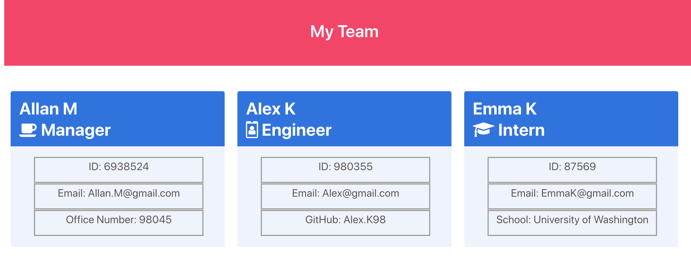

# Team-ProfileGen
A Node.js command-line application that takes in information about employees on a software engineering team and displays a summary of each one of them.

# Motivation for this project

Learn how to use the Node.js command line to take in information about employees and have it generate an HTML webpage that displays summaries for each person. As well as learn how to write a unit test for every part of the code and ensure that it passes each test.

# Reason for this project 

Generate a webpage that displays a software engineering team's basic info.

# What I learned from this project 

In this activity I learnt:

* The step by step breaking down method of the acceptance criteria on HW assignment and the importance of commenting especially after the code has been erased and you cannot remember what was on the code line previously.

* The importance of stackoverflow when trying to figure out what the inspect mistake made means/wants you to correct what you need fixed. 

* How to use inquirer for collecting input from the user. 

* How to use Jest for running the unit test 

# Video Demo 
https://drive.google.com/file/d/1OZ5G3ZhXHt0h5NpOkf_E0gqcusCBvNax/view

https://conso97.github.io/Team-ProfileGen/

